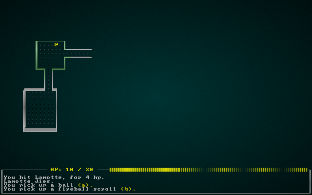

# Rouge

An experiment with [bracket_lib](https://github.com/thebracket/bracket-lib)
and [legion](https://github.com/amethyst/legion), building a simple roguelike.

This started when I followed the the excellent [Roguelike Tutorial - In Rust](https://bfnightly.bracketproductions.com/rustbook/),
to learn about ECS. It has diverted a lot.

It is not much of a game yet. Maybe one day it will be more fun playing than coding it?

## Screenshot

## Keys

* Escape - quit.
* hjkl yubn are used to walk. Hold down shift to walk until you let go of shift.
* , - pickup a thing.
* a - apply a thing.
* d - drop a thing.
* space - rest.
* When picking a target, use the mouse or press enter to choose, escape aborts.
* CTRL-P stores a screenshot in screenshot.png

Lots of things don't work. Create a PR if it bothers you.

## Building

Install [Rust](https://rust-lang.org/).

Clone the repo (you need to use the SSH link to clone the submodules).

cargo run
